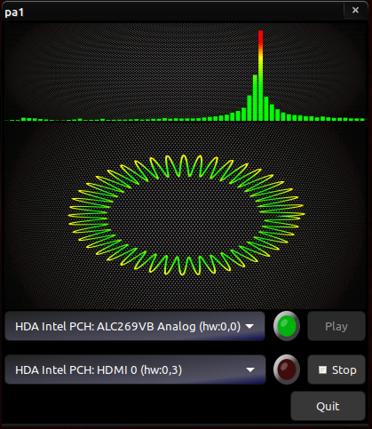

# zig-pa1
An exercise with ZIG and the C libraries: gtk and portaudio.

Just choose an input device in first dropmenu, output in second dropmenu. If both are compatible, the green led will turn on. After that point you can push the play ... and wisthle.

The first graph shows the FFT of the signal, drawn in the second.

